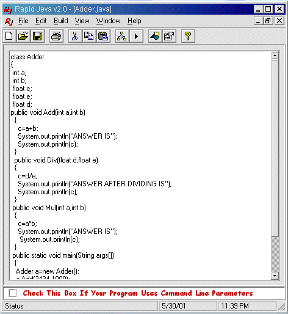



## Rapid Jeva v2\.0

### Description

www.gauravcreations.com presents A useful tool for all Java programmers. It eliminates the need to write commands for compiling or running JAVA[TM] programs.

 It acts as an interface between DOS and WINDOWS operating system thus the programmer does not have to switch between the operating systems at all 

This helps reduce the time for writing the program significantly. This tool lets the programmer compile and run the program at a single click of the mouse. Programs involving command line arguments are also supported. Apart from normal programs the programmers can even create and run applets in the applet viewer as well as the internet explorer 

Salient Features

1 )No need to write commands for compiling, running i.e. java , javac etc.

2 )No need to switch between different applications or operating systems.

Please visit www.gauravcreations.com for more cool programs
 
### More Info
 

             |
---                |---
**Submitted On**   |2001-07-10 22:53:26
**By**             |[Gaurav Creations](https://github.com/Planet-Source-Code/PSCIndex/blob/master/ByAuthor/gaurav-creations.md)
**Level**          |Intermediate
**User Rating**    |4.6 (32 globes from 7 users)
**Compatibility**  |VB 6\.0
**Category**       |[Complete Applications](https://github.com/Planet-Source-Code/PSCIndex/blob/master/ByCategory/complete-applications__1-27.md)
**World**          |[Visual Basic](https://github.com/Planet-Source-Code/PSCIndex/blob/master/ByWorld/visual-basic.md)
**Archive File**   |[Rapid Jeva25856932001\.zip](https://github.com/Planet-Source-Code/gaurav-creations-rapid-jeva-v2-0__1-26942/archive/master.zip)

